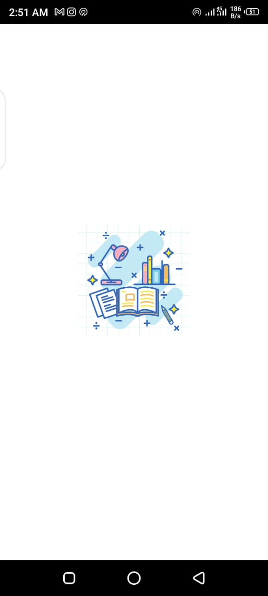
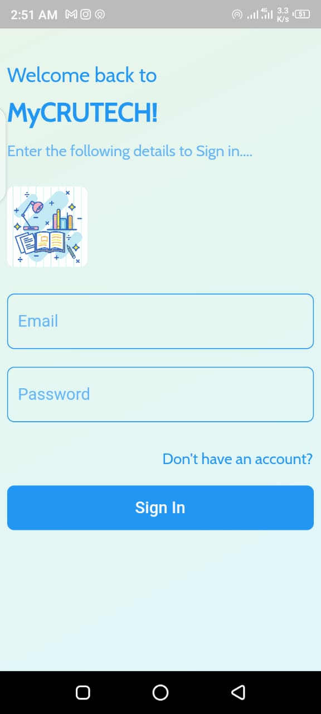
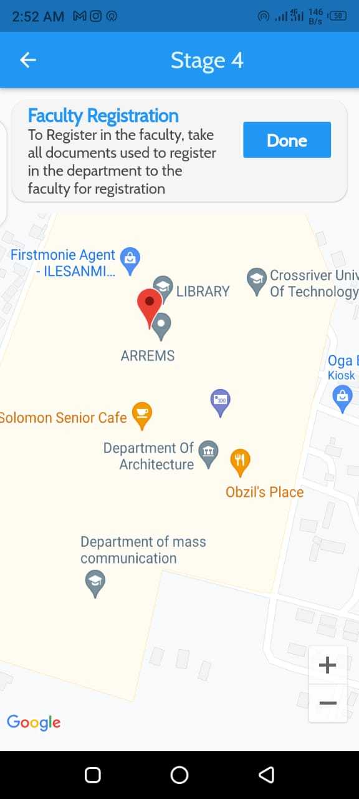
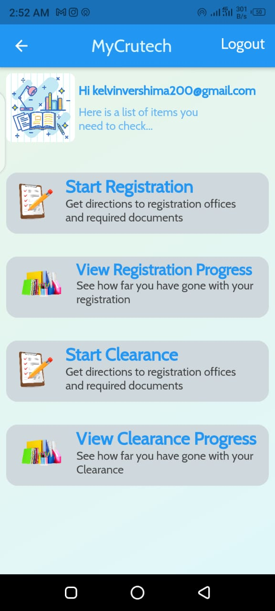
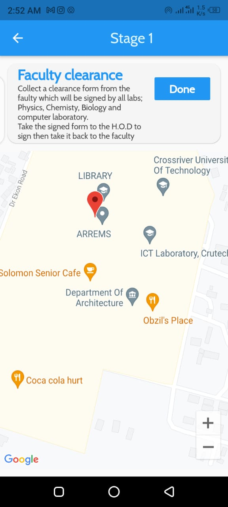
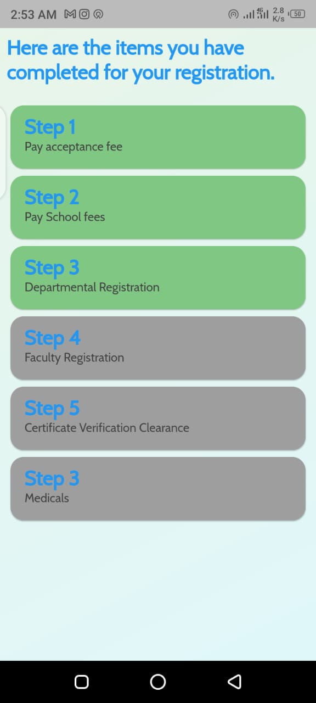

   

<h3 align="center">MyCRUTECH</>
    

   
   
## Project Overview   

MyCRUTECH is an app i built as my Bachelor of Science Project work. The topic of the project was DESIGN AND IMPLEMENTATION OF A STUDENT GUIDE FOR REGISTRING AND CLEARING STUDENTS in CRUTECH. The project was aimed at designing a system that guides newly admitted students on how to go about thier registration in the university. The app gave them information about what document was needed for a successful registration and also using google map API, it gave them directions to the office where different registration is done, also helping them keep track of thier progress. The app was not limited to Registering student, it also guided students undergoeing Clearance on how to go about thier clearance, indicating all the documents needed for clearnce, and offices for the clerance.

## Installation and Usage
To run the source code in your IDE, clone the repo

*--  git clone https://github.com/VershimaKelvin/Projerctwork*

after cloning, get all the dependencies by running

 *-- flutter pub get*
 
 
 
 
 
after getting all dependency, if no dependency issue arises, the app is ready to be run on your emulator or physical device. After the project has been deployed to device, create an account and follow all instructions that appears accordingly.

 ## ScreenShots
 
 Here are some screenshootes taken from an android device
 
 |  Screen column1  |  Screen column2  |  Screen column3
:------------:|:-------------------------:|:-------------------------:
|  | 
|  | 
 

## Pull request and Contribution
Anyone interested in this project can go ahead and fork it, all pull request will be attended to within 24 hours

